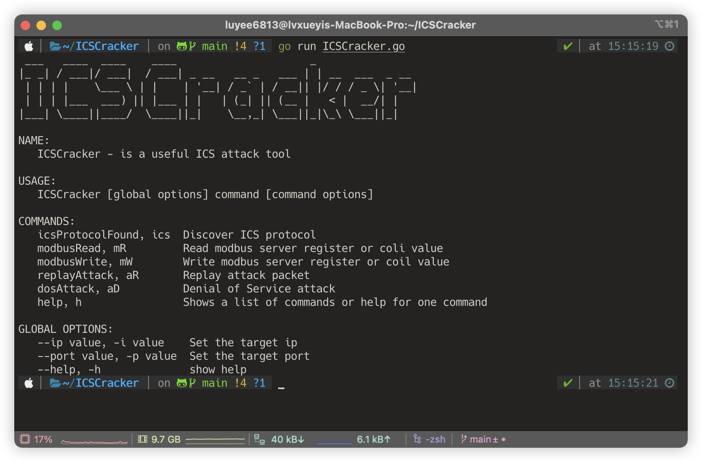

# ICSCracker



<p align="center">
  
  

</p>

## Support

<p>
  
  
  
</p>

## Requirement

=1.22-blue.svg" />

## Quick Install
```bash
git clone https://github.com/LuYee6813/ICSCracker
cd ICSCracker
go build
go install
ICSCracker
```
## License
This project is licensed under the MIT License - see the [LICENSE](LICENSE) file for details.
